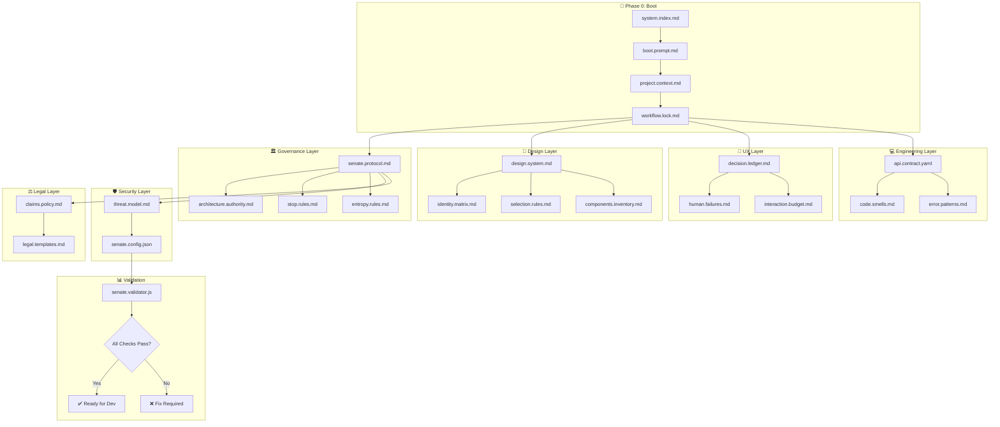

# System Architecture Diagram (The Visual Truth)

## 🎯 Purpose
> Visual representation of how all `.ai/` files interconnect and flow.

---

## 🗺️ Master Flow Diagram



---

## 🔗 File Dependency Matrix

| File | Depends On | Used By |
|------|------------|---------|
| `system.index.md` | None (Root) | Everything |
| `boot.prompt.md` | `system.index.md` | AI Execution |
| `project.context.md` | `boot.prompt.md` | All Phases |
| `workflow.lock.md` | `project.context.md` | Gate Control |
| `senate.protocol.md` | `workflow.lock.md` | Quality Enforcement |
| `design.system.md` | `workflow.lock.md` | UI Development |
| `api.contract.yaml` | `workflow.lock.md` | Backend/Frontend |
| `senate.config.json` | `senate.protocol.md` | CI/CD Scripts |
| `senate.validator.js` | `senate.config.json` | Pre-commit Hooks |

---

## 🎯 Execution Order (Strict)

```
1. READ    → system.index.md (The Brain Map)
2. LOAD    → project.context.md (Project Identity)
3. CHECK   → workflow.lock.md (Current Gate)
4. APPLY   → senate.protocol.md (Quality Rules)
5. DESIGN  → design.system.md + identity.matrix.md
6. BUILD   → api.contract.yaml + code.smells.md
7. VERIFY  → senate.validator.js (Self-Check)
8. SHIP    → Only if all gates pass
```

---

## 📁 Directory Structure

```
.ai/
├── system.index.md          # 🧠 Master Index
├── boot.prompt.md           # 🚀 AI Boot
├── workflow.lock.md         # 🔒 Gate System
├── project.context.template.md # 📋 Project Template
├── senate.config.json       # ⚙️ Machine Config
├── senate.validator.js      # ✅ Self-Validator
├── architecture.diagram.md  # 🗺️ This File
│
├── governance/
│   ├── senate.protocol.md   # 🏛️ 30 Senate Rules
│   └── architecture.authority.md
│
├── ui/
│   ├── design.system.md     # 🎨 Tokens
│   ├── identity.matrix.md   # 🧬 Visual DNA
│   ├── selection.rules.md   # 📐 Component Rules
│   └── components.inventory.md # 📦 Component Catalog
│
├── ux/
│   ├── decision.ledger.md   # 🎯 User Decisions
│   ├── human.failures.md    # ⚠️ Error Prevention
│   └── interaction.budget.md # 💰 Motion Budget
│
├── anti-patterns/
│   ├── code.smells.md       # 🚨 Bad Code
│   ├── ui.traps.md          # 🪤 Bad UX
│   ├── scaling.mistakes.md  # 📈 Growth Errors
│   └── premature.optimization.md
│
├── security/
│   └── threat.model.md      # 🛡️ Attack Surfaces
│
└── legal/
    ├── claims.policy.md     # ⚖️ Marketing Rules
    └── legal.templates.md   # 📜 Legal Text
```

---

> **"If you can't visualize the system, you can't control it."**
