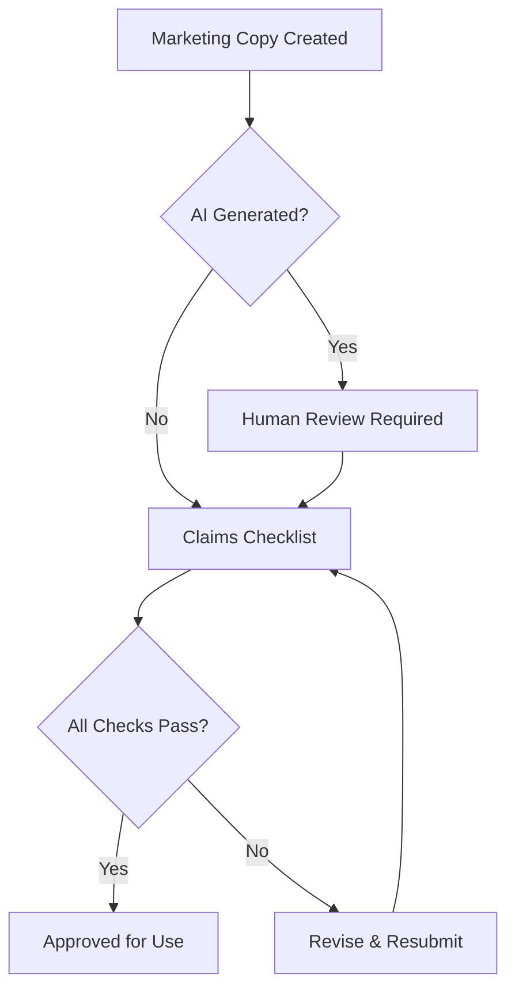

# Claims Policy (The Marketing Shield)

## 🎯 Purpose
> Define what marketing claims are ALLOWED and FORBIDDEN to prevent legal issues and AI hallucinations.
> **Rule**: Every claim must be verifiable. No exceptions.

---

## ❌ Forbidden Claims (Hard Stop)

### 🚫 Absolute Superlatives
These phrases are NEVER allowed without documented proof:
```
❌ "The best in..."
❌ "The only solution..."
❌ "The fastest..."
❌ "The cheapest..."
❌ "The most trusted..."
❌ "World-class..."
❌ "Best-in-class..."
❌ "Industry-leading..."
❌ "Revolutionary..."
❌ "Groundbreaking..."
```

### 🚫 Unverifiable Promises
```
❌ "Guaranteed results..."
❌ "100% satisfaction..."
❌ "Risk-free..."
❌ "No side effects..."
❌ "Instant results..."
❌ "Proven to..."
```

### 🚫 Medical/Financial/Legal Claims
```
❌ "Cures..."
❌ "Treats..."
❌ "Doubles your income..."
❌ "Get rich..."
❌ "Legal in all countries..."
❌ "Compliant with all regulations..."
```

### 🚫 Competitor Attacks
```
❌ "Better than [Competitor]..."
❌ "[Competitor] is inferior..."
❌ "Unlike [Competitor]..."
```

---

## ✅ Allowed Claims (With Conditions)

### ✅ Comparative (With Proof)
```
✅ "Among the fastest..." (WITH benchmark data)
✅ "Top-rated..." (WITH review source)
✅ "Award-winning..." (WITH award name/date)
```

### ✅ Qualified Statements
```
✅ "Designed to help..."
✅ "May improve..."
✅ "Many customers report..."
✅ "Our goal is to..."
✅ "We strive to..."
```

### ✅ Factual Statistics (With Source)
```
✅ "Used by X customers" (WITH date)
✅ "X% faster" (WITH benchmark methodology)
✅ "Rated X/5 on [Platform]" (WITH link)
```

---

## 📋 Claims Review Checklist

Before publishing ANY marketing copy, verify:

| # | Question | Answer Required |
|---|----------|-----------------|
| 1 | Is this claim verifiable with data? | Yes / No |
| 2 | Do we have the source/proof on file? | Link / Reference |
| 3 | Is this a superlative without proof? | Must be NO |
| 4 | Does this make medical/financial promises? | Must be NO |
| 5 | Does this attack a competitor? | Must be NO |
| 6 | Is the claim time-bound (outdated data)? | Date check |
| 7 | Would a regulator question this? | Risk assessment |

---

## 🎯 Industry-Specific Rules

### Service Business (Salon, Clinic, etc.)
```yaml
Allowed:
  - "Professional team"
  - "Years of experience"
  - "Quality products"
  
Forbidden:
  - "Best barber in..."
  - "Guaranteed transformation"
  - Medical claims (unless licensed)
```

### E-commerce
```yaml
Allowed:
  - "Free shipping over $X"
  - "X-day returns"
  - Product specifications
  
Forbidden:
  - "Lowest prices guaranteed"
  - "Best quality" (without certification)
  - Fake scarcity ("Only 2 left!" when false)
```

### SaaS / Tech
```yaml
Allowed:
  - "X% uptime SLA"
  - "GDPR compliant" (if certified)
  - "Used by X companies"
  
Forbidden:
  - "Unhackable"
  - "100% secure"
  - "Instant ROI"
```

---

## 🤖 AI Content Policy

### When AI Generates Marketing Copy:

1. **Flag for Review**: All AI-generated marketing must be reviewed by a human.
2. **No Invention**: AI must not invent statistics, awards, or testimonials.
3. **Source Requirement**: Every claim must reference a source document.
4. **Hallucination Check**: Compare against known facts in `project.context.md`.

### AI Prompt Safety Rules:
```
❌ "Write compelling copy that claims we're the best..."
✅ "Write copy based ONLY on the facts in project.context.md..."

❌ "Make the product sound amazing..."
✅ "Describe the features accurately with qualified language..."
```

---

## ⚖️ Review Process



---

## 📁 Evidence Repository

All claims must have supporting evidence stored in:
```
/docs/claims-evidence/
├── testimonials/
│   └── [customer-name]-[date].pdf
├── awards/
│   └── [award-name]-[year].pdf
├── certifications/
│   └── [cert-name].pdf
├── statistics/
│   └── [metric]-[date].pdf
└── benchmarks/
    └── [test-name]-[date].md
```

---

> **"An unverifiable claim is a lawsuit waiting to happen."**
