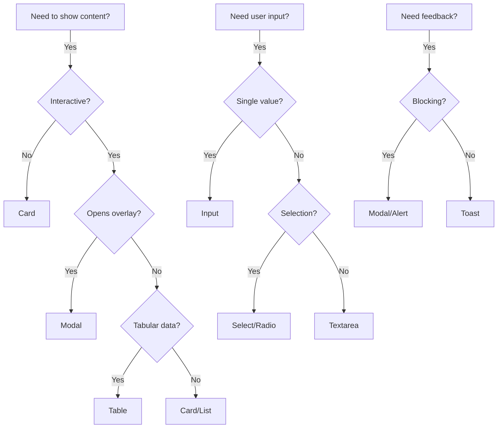

# Component Inventory (The UI Catalog)

## 🎯 Purpose
> Complete catalog of all UI components with their states, variants, and usage rules.
> **Rule**: If a component isn't here, it doesn't exist in your design system.

---

## 📦 Core Components

### 🔘 Button
```yaml
Variants:
  - primary:    "Main CTA actions"
  - secondary:  "Supporting actions"
  - ghost:      "Low-emphasis actions"
  - destructive: "Delete/Remove actions"
  - link:       "Navigation-style buttons"

Sizes:
  - sm:  "Compact areas, tables"
  - md:  "Default usage"
  - lg:  "Hero sections, prominent CTAs"
  - icon: "Icon-only buttons"

States:
  - default:   "Normal appearance"
  - hover:     "Mouse over"
  - active:    "Being clicked"
  - focus:     "Keyboard navigation"
  - disabled:  "Not interactive"
  - loading:   "Async operation in progress"

Rules:
  - ✅ DO: Use loading state for async actions
  - ✅ DO: Include aria-label for icon-only buttons
  - ❌ DON'T: Use destructive for non-destructive actions
  - ❌ DON'T: Nest buttons inside buttons
```

---

### 🃏 Card
```yaml
Variants:
  - default:   "Standard content card"
  - elevated:  "Prominent/featured content"
  - outline:   "Subtle, bordered"
  - interactive: "Clickable cards"
  - glass:     "Premium, blur effect"

States:
  - default:   "Content visible"
  - loading:   "Skeleton placeholder"
  - empty:     "No content message"
  - error:     "Failed to load"

Anatomy:
  - CardHeader:  "Title + actions"
  - CardContent: "Main content"
  - CardFooter:  "Actions/metadata"

Rules:
  - ✅ DO: Maintain consistent padding
  - ✅ DO: Use skeleton for loading
  - ❌ DON'T: Mix card styles in same grid
```

---

### 📝 Input
```yaml
Types:
  - text:      "General text input"
  - email:     "Email with validation"
  - password:  "Hidden input"
  - number:    "Numeric input"
  - search:    "Search field with icon"
  - textarea:  "Multi-line text"

States:
  - default:   "Ready for input"
  - focus:     "Currently editing"
  - filled:    "Has content"
  - error:     "Validation failed"
  - disabled:  "Not editable"
  - readonly:  "View-only"

Anatomy:
  - Label:     "Required, describes field"
  - Input:     "The input itself"
  - HelperText: "Additional guidance"
  - ErrorText: "Validation message"

Rules:
  - ✅ DO: Always include a label
  - ✅ DO: Show error messages inline
  - ❌ DON'T: Use placeholder as label
  - ❌ DON'T: Disable without explanation
```

---

### 🪟 Modal / Dialog
```yaml
Variants:
  - dialog:    "Content/forms"
  - alert:     "Important messages"
  - confirm:   "Destructive confirmations"
  - sheet:     "Mobile bottom sheets"

States:
  - open:      "Visible, with overlay"
  - closed:    "Hidden"
  - loading:   "Content loading"

Anatomy:
  - Overlay:   "Background dimming"
  - Container: "Modal box"
  - Header:    "Title + close button"
  - Body:      "Main content"
  - Footer:    "Action buttons"

Rules:
  - ✅ DO: Trap focus inside modal
  - ✅ DO: Close on Escape key
  - ✅ DO: Close on overlay click (non-critical)
  - ❌ DON'T: Stack multiple modals
  - ❌ DON'T: Use modal for simple messages
```

---

### 📊 Table / DataTable
```yaml
Features:
  - sorting:   "Column sort"
  - filtering: "Search/filter"
  - pagination: "Page navigation"
  - selection: "Row selection"
  - actions:   "Row actions"

States:
  - loading:   "Skeleton rows"
  - empty:     "No data message"
  - error:     "Failed to load"
  - partial:   "Some rows loading"

Rules:
  - ✅ DO: Show row count
  - ✅ DO: Indicate sortable columns
  - ✅ DO: Zebra stripe for readability
  - ❌ DON'T: Horizontal scroll on mobile (use cards)
```

---

### 🔔 Toast / Notification
```yaml
Variants:
  - success:   "Action completed"
  - error:     "Action failed"
  - warning:   "Caution needed"
  - info:      "Neutral information"

Behavior:
  - auto-dismiss: "5s default"
  - persistent:   "Requires user action"
  - stacking:     "Max 3 visible"

Rules:
  - ✅ DO: Position consistently (top-right or bottom-right)
  - ✅ DO: Allow manual dismissal
  - ❌ DON'T: Use for critical errors (use modal)
  - ❌ DON'T: Show more than 3 at once
```

---

### 📱 Navigation
```yaml
Types:
  - navbar:    "Top navigation bar"
  - sidebar:   "Side navigation"
  - breadcrumb: "Location indicator"
  - tabs:      "Content switching"
  - pagination: "Page navigation"

States:
  - default:   "Normal"
  - active:    "Current page/section"
  - collapsed: "Mobile/minimized"

Rules:
  - ✅ DO: Highlight current page
  - ✅ DO: Mobile hamburger menu
  - ❌ DON'T: More than 7 top-level items
```

---

## 🎯 Component Usage Decision Tree



---

## ✅ Component Checklist (Per Component)

| Check | Description |
|-------|-------------|
| [ ] All states documented | Default, Hover, Active, Focus, Disabled, Loading, Error, Empty |
| [ ] Accessibility verified | ARIA labels, keyboard navigation, screen reader |
| [ ] Responsive behavior | Mobile, Tablet, Desktop |
| [ ] RTL support | Right-to-left languages |
| [ ] Dark mode | Theme compatibility |
| [ ] Motion defined | Transitions, animations |
| [ ] Tokens only | No hardcoded colors/sizes |

---

> **"A component without documentation doesn't exist."**
